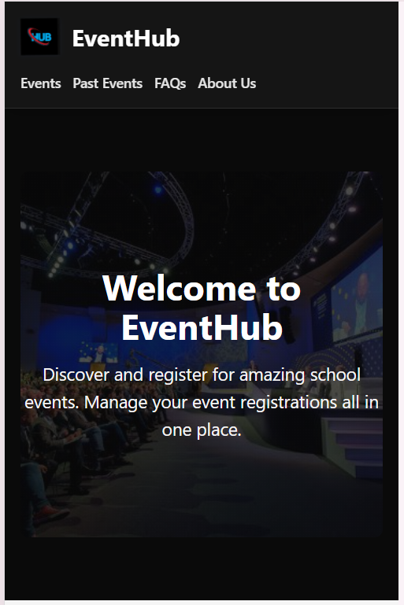

# EventHub

EventHub is a responsive student event registration dashboard. Students can browse events, search by title, category, or location, view dates and available seats, and register or cancel registrations.

 Features

- Responsive layout for mobile, tablet, and desktop screens
- Animated EventHub logo
- Event cards with date, location, seat count, and registration progress
- Add new events with title, category, date, location, and total seats
- Search events by title, category, or location
- Past Events section with testimonial-style content
- FAQs and About Us sections
- Footer with quick links and project information
- Browser localStorage support for saving event data

## visibility

Add your website screenshot to the `img` folder, then update the image name below if needed.


. Project Structure

```text
weekly assign ment/
├── index.html
├── app.js
├── README.md
└── img/
    ├── banner.jpg
    ├── event.png
    └── screenshot.png
```

## How To Run

Open `index.html` in a browser.

No build step is required because the project uses HTML, Tailwind CDN, and JavaScript().
